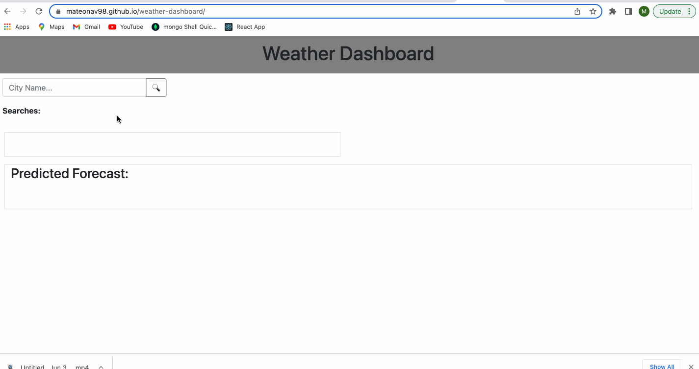

# Weather Dashboard

## Description

Search for current and future conditions of any city using this weather dashboard. 

## Table of Contents
* [Usage](#usage)
* [Demo](#demo)
* [Technologies Used](#technologies-used)
* [Contributors](#contributors)
* [License](#license)

## Usage

Search for a city in the text box and find the current and future weather conditions for that city. You will be presented with the city name, the date, an icon representation of weather conditions, the temperature, the humidity, the wind speed, and the UV index. The UV index is also color coded to indicate whether the conditions are favorable, moderate, or severe. Check out the five day forcase to plan your week as well!

## Demo

## Technologies Used 

1. HTML
2. Javascript
3. Bootstrap
4. jQuery
5. Moment.js

## Contributors
* Mateo Navarro [LinkedIn](https://www.linkedin.com/in/mateonav/) | [GitHub](https://github.com/mateonav98)

## License

Copyright (c) 2022 Mateo Navarro

Permission is hereby granted, free of charge, to any person obtaining a copy
of this software and associated documentation files (the "Software"), to deal
in the Software without restriction, including without limitation the rights
to use, copy, modify, merge, publish, distribute, sublicense, and/or sell
copies of the Software, and to permit persons to whom the Software is
furnished to do so, subject to the following conditions:

The above copyright notice and this permission notice shall be included in all
copies or substantial portions of the Software.

THE SOFTWARE IS PROVIDED "AS IS", WITHOUT WARRANTY OF ANY KIND, EXPRESS OR
IMPLIED, INCLUDING BUT NOT LIMITED TO THE WARRANTIES OF MERCHANTABILITY,
FITNESS FOR A PARTICULAR PURPOSE AND NONINFRINGEMENT. IN NO EVENT SHALL THE
AUTHORS OR COPYRIGHT HOLDERS BE LIABLE FOR ANY CLAIM, DAMAGES OR OTHER
LIABILITY, WHETHER IN AN ACTION OF CONTRACT, TORT OR OTHERWISE, ARISING FROM,
OUT OF OR IN CONNECTION WITH THE SOFTWARE OR THE USE OR OTHER DEALINGS IN THE
SOFTWARE.

